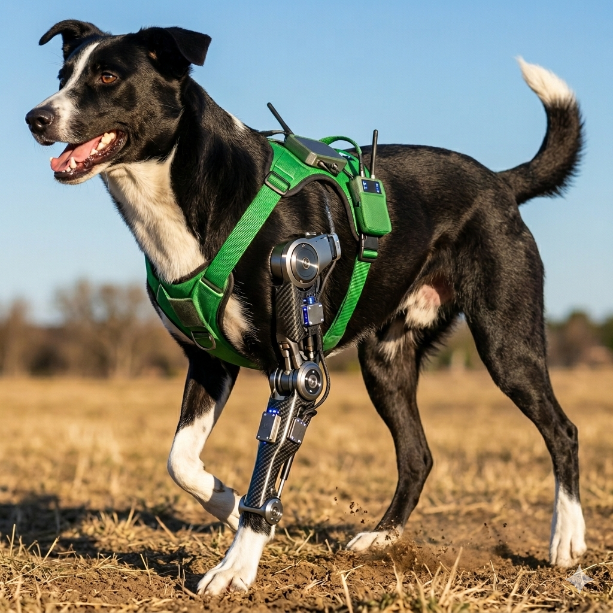

> **Disclaimer.** This work is conducted in collaboration with veterinarians. No real prosthesis has been used on animals in real life. Data collection is carried out solely using a sensor jacket (IMU vest) worn by dogs to gather movement data; no prosthetic devices are attached to or tested on live animals.

---

# BARK — Bionic Artificial Robotic Kinetics



RL/IL training pipeline to learn how one dog leg depends on the other three, for prosthetic leg prediction. Uses MuJoCo + Gymnasium for simulation, Stable-Baselines3 for RL, and W&B (or Comet) for training visualization. Jacket (IMU vest) data supports sim-to-real alignment.

## Setup

```bash
cd bark
python -m venv .venv
source .venv/bin/activate  # or .venv\Scripts\activate on Windows
pip install -r requirements.txt
```

## Structure

- **`envs/`** — Custom Gymnasium envs: 3-leg observation → 4th-leg (or full-body) action.
- **`train/`** — RL (PPO/SAC) and IL training scripts with W&B/Comet logging.
- **`data/`** — Jacket CSV loaders and reference trajectory conversion.
- **`configs/`** — Env names, rewards, hyperparameters, logging.
- **`scripts/`** — Data generation, jacket CSV → reference trajectories.

## Quick start

Train a PPO policy on the Ant-based “3 legs → 4th leg” env:

```bash
python -m train.train_rl --config configs/ppo_ant_3leg.yaml
```

With Weights & Biases (set `WANDB_API_KEY` or run `wandb login`):

```bash
python -m train.train_rl --config configs/ppo_ant_3leg.yaml --wandb
```

With Comet ML (set `COMET_API_KEY`):

```bash
python -m train.train_rl --config configs/ppo_ant_3leg.yaml --comet
```

Both log training curves (episode reward, loss, etc.). W&B also supports video logging via its SB3 integration.

## Adversarial Motion Priors (AMP)

AMP rewards the policy for producing state transitions (s, s') that look like reference (expert) motion. A discriminator is trained to tell expert vs policy transitions; the policy gets a style reward for fooling it.

1. **Collect expert rollouts** (same format as IL):  
   `python -m train.train_il --config configs/bc_ant_3leg.yaml --collect_demos 50`  
   This writes `demos/expert_rollouts.npz` (or set path via `--expert_path`).

2. **Train with AMP**:  
   `python -m train.train_rl --config configs/ppo_ant_3leg_amp.yaml`  
   Set `amp.expert_path` in the config to your `.npz` path. Tune `amp.style_weight` to balance task reward vs style (e.g. `1.0`).

Config: `amp.enabled`, `amp.expert_path`, `amp.style_weight`, `amp.disc_lr`, `amp.disc_batch_size`, `amp.max_transitions`, etc.

## Jacket data

Place jacket CSV files (IMU1–IMU3 as features, IMU4 as target) in `data/raw/` or set `data.jacket_csv` in config. Use `scripts/jacket_to_reference.py` to convert to reference trajectories for reward shaping or IL.

## Sim-to-real and jacket

- **Jacket CSV**: Use `data/jacket_loader.py` and `scripts/jacket_to_reference.py` to load IMU data and build reference trajectories.
- **Domain randomization**: In `configs/ppo_ant_3leg.yaml` set `env_kwargs: { obs_noise_std: 0.02 }` to add observation noise in simulation.
- **Calibration**: See [docs/SIM_TO_REAL.md](docs/SIM_TO_REAL.md) for jacket coordinate frame, units, and reference-matching rewards.

## License

MIT.
Summary of what’s in place:

## 1. **Repo bootstrap**
- **Layout**: `envs/`, `train/`, `data/`, `configs/`, `scripts/`, `docs/`
- **requirements.txt**: gymnasium[mujoco], mujoco, stable-baselines3, wandb, imitation, scipy, pyyaml
- **pyproject.toml**: package config for `envs`, `train`, `data`
- **README.md**: setup, usage, quick start

## 2. **Custom env (BarkAnt3Leg)**
- **`envs/bark_ant_3leg.py`**: Subclass of Gymnasium Ant; obs = torso + legs 0–2 only (23 dims), action = full 8D.
- **Registration**: `BarkAnt3Leg-v0` registered on import.
- **Sim-to-real**: Optional `obs_noise_std` in env `__init__` for observation noise.

## 3. **RL training**
- **`train/train_rl.py`**: PPO/SAC from YAML (e.g. `configs/ppo_ant_3leg.yaml`), EvalCallback, config path resolved from repo root.
- **W&B**: `--wandb` uses `WandbCallback` from `wandb.integration.sb3` (or fallback custom callback).
- **Comet**: `--comet` uses `train/callbacks.py` `CometLoggerCallback`.

## 4. **Jacket data**
- **`data/jacket_loader.py`**: `load_jacket_csv()` → (X, y) for IMU1–3 vs IMU4; `jacket_to_sequences()` for sliding windows.
- **`data/reference_trajectory.py`**: `jacket_to_reference()` builds normalized reference arrays and can save `.npy`.
- **`scripts/jacket_to_reference.py`**: CLI to turn jacket CSV into reference `.npy`.

## 5. **IL (imitation)**
- **`train/train_il.py`**: BC with `imitation.algorithms.bc`; `--collect_demos N` writes expert rollouts; `--expert_path` loads `.npz` and trains BC. Expert path resolved from repo root (and cwd fallback). `TrajectoryWithRew(..., terminal=True)`, `optimizer_kwargs=dict(lr=...)`, batch size capped by demo size.
- **`configs/bc_ant_3leg.yaml`**: BC config.

## 6. **Viz**
- **W&B**: Used in `train_rl.py` via `--wandb` (metrics and optional model/video).
- **Comet**: Used via `--comet` and `CometLoggerCallback`; README updated for both.

## 7. **Sim-to-real**
- **`docs/SIM_TO_REAL.md`**: Jacket coordinate frame, units, calibration; domain randomization; reference-matching reward.
- **Env**: `obs_noise_std` in `BarkAnt3LegEnv` and in `configs/env_ant_3leg.yaml`.
- **README**: Link to SIM_TO_REAL and note on `env_kwargs.obs_noise_std`.

**How to run**
- From repo root: `PYTHONPATH=. python -m train.train_rl --config configs/ppo_ant_3leg.yaml` (add `--wandb` or `--comet` as needed).
- IL: `PYTHONPATH=. python -m train.train_il --config configs/bc_ant_3leg.yaml --expert_path demos/expert_rollouts.npz` (create demos first with `--collect_demos 30`).