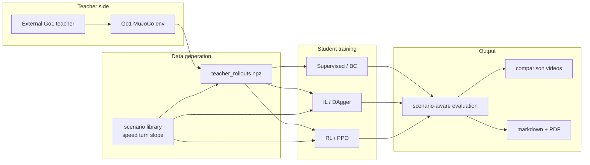
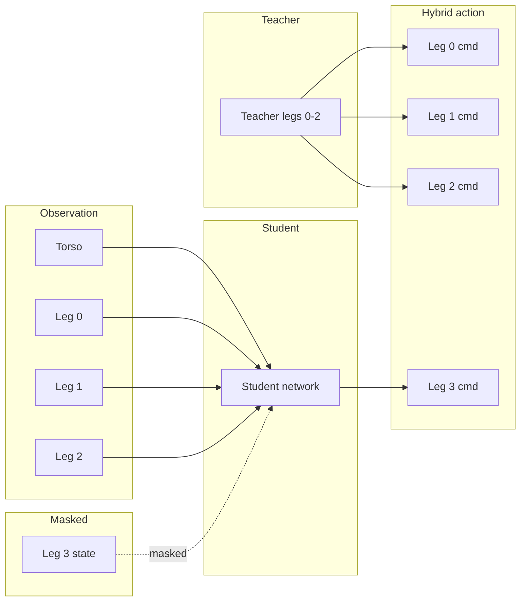
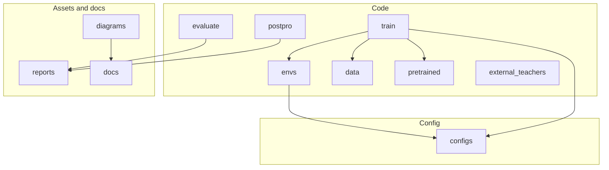

> **Disclaimer.** This work is conducted in collaboration with veterinarians. No real prosthesis has been used on animals in real life. Data collection is carried out solely using a sensor jacket (IMU vest) worn by dogs to gather movement data; no prosthetic devices are attached to or tested on live animals.

---

# BARK — Bionic Artificial Robotic Kinetics

**BARK** is a research project aimed at predicting dog movement so that prosthetic legs can be driven **without neurosurgery**. The idea: if we can learn how one leg moves in relation to the other three, we can use that to control a robotic replacement for a missing or impaired leg, using only sensors on the healthy legs—no brain implants or invasive interfaces.

A core part of the stack is **real-world data**. We collect movement from healthy dogs using a sensor jacket: a harness with IMUs (inertial measurement units) on the back and wires down to wraps on each leg. The dog walks and runs normally while we log acceleration, angular velocity, and orientation at tens to hundreds of Hz. That data is used to build reference motions, to shape rewards in simulation, and to bridge the gap between sim and real (e.g. via domain randomization and calibration). The photo below shows the jacket in use on a Labrador.


---

## Contents

- [Pipeline overview](#pipeline-overview)
- [Prosthetic Go1 stack](#prosthetic-go1-stack)
- [The 3-leg → 4th-leg idea](#the-3-leg--4th-leg-idea)
- [What's in the repo](#whats-in-the-repo)
- [Setup](#setup)
- [Quick start](#quick-start)
- [Prosthetic Go1 quick start](#prosthetic-go1-quick-start)
- [Run 3D visualization](#run-3d-visualization)
- [Imitation and AMP](#imitation-and-adversarial-motion-priors-amp)
- [Jacket data and sim-to-real](#jacket-data-and-sim-to-real)
- [License](#license)

---

## Pipeline overview

End-to-end flow for the current prosthetic Go1 stack:



- **Teacher side**: a working external Go1 teacher runs in the full MuJoCo environment.
- **Data generation**: teacher rollouts are collected across speed, turn, and slope scenarios.
- **Student training**: the saved dataset feeds the supervised baseline, explicit IL / DAgger, and PPO prosthetic RL.
- **Output**: evaluation plots, comparison videos, and interview-ready markdown / PDF reports.

---

## Prosthetic Go1 stack

The repo now also contains a more interview-ready **teacher-student prosthetic Go1 pipeline** built around a working external Unitree Go1 teacher.

In this setup:

- the **teacher** controls legs `0-2`
- the **student** controls only the missing rear-left leg (`leg 3`)
- the student receives a masked `39`-D observation
- the student predicts only `3` joint commands for the prosthetic leg

Three student paths are supported:

- **Supervised / behavior cloning**: direct regression from masked observation to teacher leg-3 action
- **Explicit imitation learning**: BC initialization plus DAgger-style aggregation on student-induced states
- **RL / PPO**: hybrid control with teacher tracking in the reward

The current shared scenario library supports:

- forward speed regimes: chill / slow / medium / fast / run
- turning commands
- command-conditioned lateral variants
- real uphill / downhill cases by tilting the MuJoCo floor plane at runtime

Main artifacts live under:

- `train/`: data generation, supervised, IL, PPO, full experiment runner
- `envs/`: prosthetic hybrid env and scenario library
- `evaluate/`: teacher vs supervised vs IL vs RL comparison
- `postpro/`: figures, videos, report generation, PDF export
- `reports/`: interview markdown, plots, videos, PDF

---

## The 3-leg → 4th-leg idea

In the current prosthetic Go1 setup we **hide** the fourth leg's state from the student. The student only sees the torso and legs `0-2`; it must **infer** how leg `3` (the prosthetic leg) should move. The teacher still provides the other three legs, and Bark merges the student prosthetic action back into the full action before stepping the Go1 environment.



| Stack | Student obs dim | Student action dim | Teacher action usage |
|--------|----------------:|-------------------:|----------------------|
| **Ant** (generic legacy) | 23 | 8 | student predicts full action |
| **Go1** (prosthetic stack) | 39 | 3 | teacher provides legs `0-2`, student predicts only leg `3` |

---

## What's in the repo

High-level layout:



| Folder     | Role |
|-----------|------|
| **envs/** | Prosthetic hybrid env plus the shared scenario library for speed / turn / slope variation. |
| **train/** | Teacher rollout generation, supervised BC, explicit IL / DAgger, PPO prosthetic RL, and full experiment orchestration. |
| **data/** | Generated teacher rollouts and reference data. |
| **configs/** | YAML configs for supervised, IL, PPO, and legacy Ant / Go1 experiments. |
| **evaluate/** | Teacher vs supervised vs IL vs RL quantitative comparison. |
| **postpro/** | Rendering, report generation, cross-run analysis, and markdown-to-PDF export. |
| **pretrained/** | Teacher loading and local pretrained-model integration. |
| **external_teachers/** | Adapter layer for external teacher repos such as the working Go1 policy. |
| **diagrams/** | Mermaid sources and exported figures used in the interview material. |
| **reports/** | Interview markdown, PDF, plots, and rendered comparison videos. |
| **docs/** | Sim-to-real notes and student pipeline documentation. |

---

## Setup

From the repo root:

```bash
python -m venv .venv
# Windows: .venv\Scripts\activate   |   Linux/macOS: source .venv/bin/activate
pip install -r requirements.txt
```

Main dependencies: `gymnasium[mujoco]`, `mujoco`, `stable-baselines3`, `imitation`, and optional `wandb` / `comet-ml` for logging.

---

## Quick start

**Option A — Generic Ant (no extra setup)**  

From repo root (on Windows you can omit `PYTHONPATH=.` when using `python -m` from the repo):

```bash
PYTHONPATH=. python -m train.train_rl --config configs/ppo_ant_3leg.yaml
```

**Option B — Dog-like Unitree Go1**  

Download the Go1 model once, then train:

```bash
python scripts/get_go1_model.py
PYTHONPATH=. python -m train.train_rl --config configs/ppo_go1_3leg.yaml
```

Training logs to TensorBoard (`logs/tensorboard`). A custom callback logs **per-leg action statistics**. After training, plot reward and per-leg metrics:

```bash
PYTHONPATH=. python scripts/visualize_training.py --logdir logs/tensorboard --out logs/figures
```

**What to look for**

| Metric | Where | Interpretation |
|--------|--------|----------------|
| **Reward / episode length** | `logs/figures/training_reward.png` | Higher reward and longer episodes = policy moves forward and stays up. |
| **Leg3 vs others action ratio** | `logs/figures/per_leg_actions.png` | Ratio near 1 = prosthetic leg behaves like the other legs. |

Optional: `--wandb` or `--comet` for experiment tracking and video.

---

## Prosthetic Go1 quick start

If you want to run the prosthetic-teacher stack rather than the generic Ant/Go1 training paths above, use this flow from the repo root.

### 1. Generate teacher rollouts

```bash
python train/generate_teacher_data.py --steps 1000000 --noise 0.01 --mass-rand 0.10 --friction-rand 0.20 --scenario-pool all_train
```

This writes:

- `data/teacher_rollouts.npz`

### 2. Train the supervised baseline

```bash
python train/train_supervised.py --config configs/supervised_go1.yaml --device cuda
```

This writes:

- `models/supervised_prosthetic/`

### 3. Train the explicit IL / DAgger student

```bash
python train/train_il.py --config configs/imitation_go1.yaml --device cuda
```

This writes:

- `models/imitation_prosthetic/`

### 4. Train the PPO prosthetic RL student

```bash
python train/train_prosthetic_rl.py --config configs/prosthetic_rl_go1.yaml --device cpu
```

Note: for SB3 PPO with an MLP policy, CPU plus parallel envs is usually more efficient than forcing GPU.

This writes:

- `models/prosthetic_rl/`

### 5. Evaluate and render comparison assets

```bash
python evaluate/compare.py --episodes 24 --scenario-pool all_train
python -m postpro.render_students --all-scenarios --steps 500 --fps 30
python -m postpro.run_all
python postpro/export_markdown_pdf.py --input reports/INTERVIEW_NEURA_PROSTHETIC_GO1.md --output reports/INTERVIEW_NEURA_PROSTHETIC_GO1.pdf
```

Key outputs:

- `reports/student_comparison.png`
- `reports/student_comparison_by_scenario.png`
- `reports/leg3_tracking_error.png`
- `reports/walk_sidebyside.mp4`
- `reports/INTERVIEW_NEURA_PROSTHETIC_GO1.md`
- `reports/INTERVIEW_NEURA_PROSTHETIC_GO1.pdf`

### 6. One-command bounded experiment

For a single orchestration entry point:

```bash
python train/run_full_experiment.py --rl-device cpu
```

That command chains:

- large teacher-data generation
- supervised retraining
- IL / DAgger training
- PPO RL training
- comparison plots
- rendered videos
- post-processing reports

---

## Run 3D visualization

Spawn the quadruped in MuJoCo and watch it in a 3D window. From repo root, **no PYTHONPATH needed** for this script:

```bash
python scripts/run_dog_viz.py
```

**Go1 (dog-like) instead of Ant:**

```bash
python scripts/run_dog_viz.py --config configs/ppo_go1_3leg.yaml
```

**With a trained policy:**

```bash
python scripts/run_dog_viz.py --model models/best.zip --episodes 10
```

**Options:** `--config`, `--seed`, `--no-render` (headless), `--record` (save video to `--video-folder`). The viewer needs a display; on headless machines use `--no-render` or `--record` with a virtual display if needed.

---

## Imitation and Adversarial Motion Priors (AMP)

Pre-train or regularise the policy with expert data:

1. **Collect demos** (e.g. from a random or scripted policy):  
   `python -m train.train_il --config configs/bc_ant_3leg.yaml --collect_demos 50`  
   Saves rollouts to `demos/expert_rollouts.npz` (or path set via `--expert_path`).

2. **Train with AMP**:  
   `python -m train.train_rl --config configs/ppo_ant_3leg_amp.yaml`  
   Set `amp.expert_path` in the config to your `.npz`. The discriminator learns to tell expert vs policy transitions apart; the policy gets a style reward for matching expert motion. Tune `amp.style_weight` to balance task reward and style.

BC-only (no AMP): use `train_il.py` with `--expert_path` pointing at your demos.

---

## Jacket data and sim-to-real

- **CSV format**: Jacket data (IMU1–IMU3 as inputs, IMU4 as target or reference) goes in `data/raw/` or path set in config. Use `scripts/jacket_to_reference.py` to convert CSV to reference `.npy` for reward shaping or IL.
- **Domain randomization**: In config set `env_kwargs: { obs_noise_std: 0.02 }` (or similar) to add observation noise in sim and improve robustness for real sensors.
- **Calibration**: See [docs/SIM_TO_REAL.md](docs/SIM_TO_REAL.md) for jacket coordinate frame, units, and reference-matching rewards.

---

## License

MIT.
