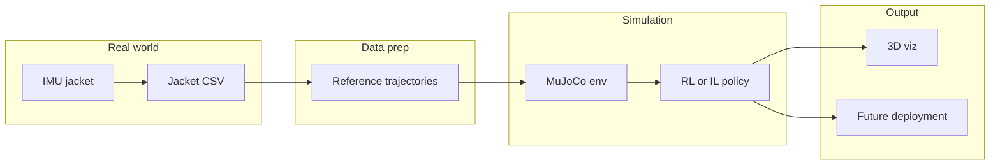
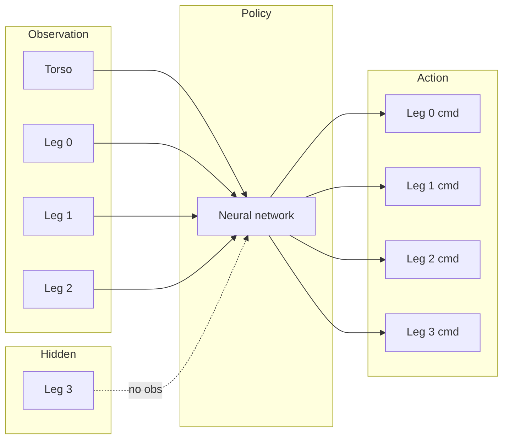
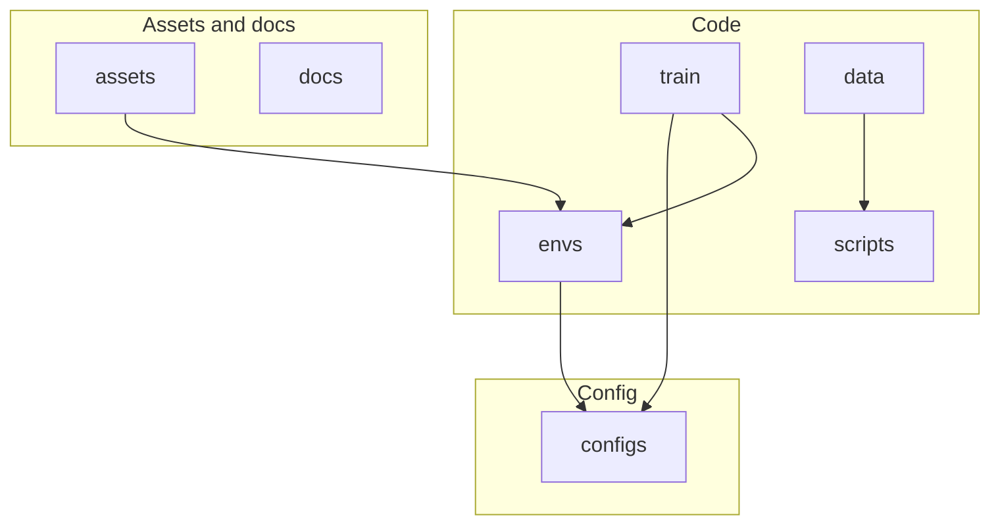

> **Disclaimer.** This work is conducted in collaboration with veterinarians. No real prosthesis has been used on animals in real life. Data collection is carried out solely using a sensor jacket (IMU vest) worn by dogs to gather movement data; no prosthetic devices are attached to or tested on live animals.

---

# BARK — Bionic Artificial Robotic Kinetics

**BARK** is a research project aimed at predicting dog movement so that prosthetic legs can be driven **without neurosurgery**. The idea: if we can learn how one leg moves in relation to the other three, we can use that to control a robotic replacement for a missing or impaired leg, using only sensors on the healthy legs—no brain implants or invasive interfaces.

A core part of the stack is **real-world data**. We collect movement from healthy dogs using a sensor jacket: a harness with IMUs (inertial measurement units) on the back and wires down to wraps on each leg. The dog walks and runs normally while we log acceleration, angular velocity, and orientation at tens to hundreds of Hz. That data is used to build reference motions, to shape rewards in simulation, and to bridge the gap between sim and real (e.g. via domain randomization and calibration). The photo below shows the jacket in use on a Labrador.


---

## Contents

- [Pipeline overview](#pipeline-overview)
- [The 3-leg → 4th-leg idea](#the-3-leg--4th-leg-idea)
- [What's in the repo](#whats-in-the-repo)
- [Setup](#setup)
- [Quick start](#quick-start)
- [Run 3D visualization](#run-3d-visualization)
- [Imitation and AMP](#imitation-and-adversarial-motion-priors-amp)
- [Jacket data and sim-to-real](#jacket-data-and-sim-to-real)
- [License](#license)

---

## Pipeline overview

End-to-end flow from real dog data to trained policies and 3D visualization:



- **Real world**: Dog wears the jacket; we log IMU data to CSV.
- **Data prep**: CSV is converted to reference trajectories (`.npy`) for reward shaping or imitation.
- **Simulation**: MuJoCo env (Ant or Go1) with 3-leg observation; the policy learns to drive all four legs.
- **Output**: 3D viewer to watch the robot walk/run; later, export for real hardware.

---

## The 3-leg → 4th-leg idea

In simulation we **hide** the fourth leg’s state from the agent. The policy only sees the torso and legs 0–2; it must **infer** how leg 3 (the “prosthetic”) should move and output commands for all four legs. That mirrors the real setting: we only have sensors on the healthy legs and must predict the missing one.



| Robot   | Obs dim | Action dim | Leg 3 in obs? |
|--------|---------|------------|----------------|
| **Ant** (generic) | 23      | 8          | No (masked)    |
| **Go1** (dog-like) | 31    | 12         | No (masked)    |

---

## What's in the repo

High-level layout:



| Folder     | Role |
|-----------|------|
| **envs/** | **BarkAnt3Leg**: generic Ant (8 joints, 23-dim obs, 8D action). **BarkGo1_3Leg**: dog-like Unitree Go1 (12 joints, 31-dim obs, 12D action). Both mask leg 3 so the policy predicts the prosthetic leg from the other three. |
| **train/** | RL (PPO/SAC) and IL (BC) training, AMP discriminator, callbacks for TensorBoard and per-leg metrics. |
| **data/** | Jacket CSV loaders and reference trajectory conversion (`.npy`) for reward shaping or IL. |
| **configs/** | YAML configs for env, PPO/SAC, BC, AMP (Ant and Go1). |
| **scripts/** | `jacket_to_reference.py`, `visualize_training.py`, `run_dog_viz.py` (3D viewer), `get_go1_model.py` (download Go1 assets). |
| **assets/** | Optional: `unitree_go1/` (scene, model, meshes) after running `get_go1_model.py`. |
| **docs/** | Sim-to-real and jacket calibration ([SIM_TO_REAL.md](docs/SIM_TO_REAL.md)). |

---

## Setup

From the repo root:

```bash
python -m venv .venv
# Windows: .venv\Scripts\activate   |   Linux/macOS: source .venv/bin/activate
pip install -r requirements.txt
```

Main dependencies: `gymnasium[mujoco]`, `mujoco`, `stable-baselines3`, `imitation`, and optional `wandb` / `comet-ml` for logging.

---

## Quick start

**Option A — Generic Ant (no extra setup)**  

From repo root (on Windows you can omit `PYTHONPATH=.` when using `python -m` from the repo):

```bash
PYTHONPATH=. python -m train.train_rl --config configs/ppo_ant_3leg.yaml
```

**Option B — Dog-like Unitree Go1**  

Download the Go1 model once, then train:

```bash
python scripts/get_go1_model.py
PYTHONPATH=. python -m train.train_rl --config configs/ppo_go1_3leg.yaml
```

Training logs to TensorBoard (`logs/tensorboard`). A custom callback logs **per-leg action statistics**. After training, plot reward and per-leg metrics:

```bash
PYTHONPATH=. python scripts/visualize_training.py --logdir logs/tensorboard --out logs/figures
```

**What to look for**

| Metric | Where | Interpretation |
|--------|--------|----------------|
| **Reward / episode length** | `logs/figures/training_reward.png` | Higher reward and longer episodes = policy moves forward and stays up. |
| **Leg3 vs others action ratio** | `logs/figures/per_leg_actions.png` | Ratio near 1 = prosthetic leg behaves like the other legs. |

Optional: `--wandb` or `--comet` for experiment tracking and video.

---

## Run 3D visualization

Spawn the quadruped in MuJoCo and watch it in a 3D window. From repo root, **no PYTHONPATH needed** for this script:

```bash
python scripts/run_dog_viz.py
```

**Go1 (dog-like) instead of Ant:**

```bash
python scripts/run_dog_viz.py --config configs/ppo_go1_3leg.yaml
```

**With a trained policy:**

```bash
python scripts/run_dog_viz.py --model models/best.zip --episodes 10
```

**Options:** `--config`, `--seed`, `--no-render` (headless), `--record` (save video to `--video-folder`). The viewer needs a display; on headless machines use `--no-render` or `--record` with a virtual display if needed.

---

## Imitation and Adversarial Motion Priors (AMP)

Pre-train or regularise the policy with expert data:

1. **Collect demos** (e.g. from a random or scripted policy):  
   `python -m train.train_il --config configs/bc_ant_3leg.yaml --collect_demos 50`  
   Saves rollouts to `demos/expert_rollouts.npz` (or path set via `--expert_path`).

2. **Train with AMP**:  
   `python -m train.train_rl --config configs/ppo_ant_3leg_amp.yaml`  
   Set `amp.expert_path` in the config to your `.npz`. The discriminator learns to tell expert vs policy transitions apart; the policy gets a style reward for matching expert motion. Tune `amp.style_weight` to balance task reward and style.

BC-only (no AMP): use `train_il.py` with `--expert_path` pointing at your demos.

---

## Jacket data and sim-to-real

- **CSV format**: Jacket data (IMU1–IMU3 as inputs, IMU4 as target or reference) goes in `data/raw/` or path set in config. Use `scripts/jacket_to_reference.py` to convert CSV to reference `.npy` for reward shaping or IL.
- **Domain randomization**: In config set `env_kwargs: { obs_noise_std: 0.02 }` (or similar) to add observation noise in sim and improve robustness for real sensors.
- **Calibration**: See [docs/SIM_TO_REAL.md](docs/SIM_TO_REAL.md) for jacket coordinate frame, units, and reference-matching rewards.

---

## License

MIT.
