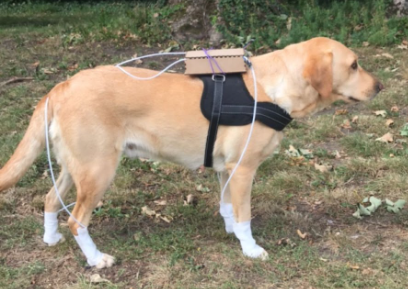

> **Disclaimer.** This work is conducted in collaboration with veterinarians. No real prosthesis has been used on animals in real life. Data collection is carried out solely using a sensor jacket (IMU vest) worn by dogs to gather movement data; no prosthetic devices are attached to or tested on live animals.

---

# BARK — Bionic Artificial Robotic Kinetics

**BARK** is a research project aimed at predicting dog movement so that prosthetic legs can be driven without neurosurgery. The idea: if we can learn how one leg moves in relation to the other three, we can use that to control a robotic replacement for a missing or impaired leg, using only sensors on the healthy legs—no brain implants or invasive interfaces.

A core part of the stack is **real-world data**. We collect movement from healthy dogs using a sensor jacket: a harness with IMUs (inertial measurement units) on the back and wires down to wraps on each leg. The dog walks and runs normally while we log acceleration, angular velocity, and orientation at tens to hundreds of Hz. That data is used to build reference motions, to shape rewards in simulation, and to bridge the gap between sim and real (e.g. via domain randomization and calibration). The photo below shows the jacket in use on a Labrador.



---

## What’s in the repo: full stack

The project combines several research directions into one pipeline:

- **Reinforcement learning (RL)** — An agent in simulation learns to move a quadruped (Ant) forward and stay healthy. The twist: the observation space hides the fourth leg’s state, so the policy must *infer* how that leg should move from the other three. That mimics the prosthetic setting: we only “see” the healthy legs and must predict the missing one.
- **Imitation learning (IL)** — We can pre-train or shape behavior using expert data (e.g. from the jacket or from scripted gaits). Behavioural cloning (BC) and optional Adversarial Motion Priors (AMP) let the policy imitate reference motion while still optimising for task rewards.
- **Simulation and 3D viz** — MuJoCo (via Gymnasium) provides the physics and the quadruped model. Training runs headless; a separate script lets you spawn the dog in a 3D window and watch it walk or run, with or without a trained policy.
- **Sim-to-real** — Jacket CSV data is loaded, converted to reference trajectories, and used for reward shaping or IL. Domain randomization (e.g. observation noise) and calibration docs help narrow the sim-to-real gap when moving toward real hardware.

So in one place you get: **real measurements (jacket)** → **reference trajectories and rewards** → **RL/IL training in MuJoCo** → **3D visualization and (future) deployment**.

---

## Setup

From the repo root:

```bash
python -m venv .venv
# Windows: .venv\Scripts\activate   |   Linux/macOS: source .venv/bin/activate
pip install -r requirements.txt
```

Main dependencies: `gymnasium[mujoco]`, `mujoco`, `stable-baselines3`, `imitation`, and optional `wandb` / `comet-ml` for logging.

---

## Project layout

| Folder     | Role |
|-----------|------|
| **envs/** | Gymnasium environments. The main one is **BarkAnt3Leg**: Ant quadruped with observation masked to torso + legs 0–2 (23 dims); action is full 8D so the policy must drive the “prosthetic” leg (leg 3) from the other three. |
| **train/** | RL (PPO/SAC) and IL (BC) training scripts, AMP discriminator training, callbacks for TensorBoard and per-leg metrics. |
| **data/** | Jacket CSV loaders and utilities to build reference trajectories (`.npy`) for reward shaping or IL. |
| **configs/** | YAML configs for env, PPO/SAC, BC, and AMP. |
| **scripts/** | `jacket_to_reference.py` (CSV → reference), `visualize_training.py` (reward and per-leg plots), `run_dog_viz.py` (3D sim viewer). |
| **docs/** | Sim-to-real and jacket calibration ([SIM_TO_REAL.md](docs/SIM_TO_REAL.md)). |

---

## Quick start: train and evaluate

Train a PPO policy on the 3-leg→4th-leg Ant env (from repo root; on Windows PowerShell use `$env:PYTHONPATH=".";` instead of `PYTHONPATH=.`):

```bash
PYTHONPATH=. python -m train.train_rl --config configs/ppo_ant_3leg.yaml
```

Training logs to TensorBoard by default (`logs/tensorboard`). A custom callback logs **per-leg action statistics**: you can check whether the prosthetic leg (leg 3) learns to behave like the observed legs (0–2). After training, plot reward curves and per-leg metrics:

```bash
PYTHONPATH=. python scripts/visualize_training.py --logdir logs/tensorboard --out logs/figures
```

**Performance and what to look for:**  
- **Reward**: Episode reward and length in `logs/figures/training_reward.png`. A policy that moves forward and stays up gets higher reward and longer episodes.  
- **Per-leg actions**: `logs/figures/per_leg_actions.png` shows mean action magnitude per leg and the **leg3 / others ratio**. A ratio close to 1 means the prosthetic leg is acting in line with the other legs; far from 1 suggests the policy still treats leg 3 differently.

Optional: W&B (`--wandb`) or Comet (`--comet`) for experiment tracking and video.

---

## Run 3D visualization

Spawn the quadruped in MuJoCo and watch it in a 3D window:

**Bash (Linux/macOS):**
```bash
PYTHONPATH=. python scripts/run_dog_viz.py
```

**PowerShell (Windows):**
```powershell
$env:PYTHONPATH="."; python scripts/run_dog_viz.py
```

By default this runs a few episodes with **random actions** so you can confirm the sim and window work. After training, drive it with a saved policy:

```bash
PYTHONPATH=. python scripts/run_dog_viz.py --model models/best.zip --episodes 10
```
```powershell
$env:PYTHONPATH="."; python scripts/run_dog_viz.py --model models/best.zip --episodes 10
```

Options: `--config`, `--seed`, `--no-render` (headless), `--record` (save video to `--video-folder`). The robot is the same Ant used in training; the viewer needs a display (on headless machines use `--no-render` or `--record` with a virtual display if needed).

---

## Imitation and Adversarial Motion Priors (AMP)

You can pre-train or regularise the policy with expert data:

1. **Collect demos** (e.g. from a random or scripted policy):  
   `python -m train.train_il --config configs/bc_ant_3leg.yaml --collect_demos 50`  
   Saves rollouts to `demos/expert_rollouts.npz` (or path set via `--expert_path`).

2. **Train with AMP**:  
   `python -m train.train_rl --config configs/ppo_ant_3leg_amp.yaml`  
   Set `amp.expert_path` in the config to your `.npz`. The discriminator learns to distinguish expert vs policy transitions; the policy gets a style reward for matching expert motion. Tune `amp.style_weight` to balance task reward and style.

BC-only (no AMP): use `train_il.py` with `--expert_path` pointing at your demos.

---

## Jacket data and sim-to-real

- **CSV format**: Jacket data (IMU1–IMU3 as inputs, IMU4 as target or reference) goes in `data/raw/` or path set in config. Use `scripts/jacket_to_reference.py` to convert CSV to reference `.npy` for reward shaping or IL.
- **Domain randomization**: In config set `env_kwargs: { obs_noise_std: 0.02 }` (or similar) to add observation noise in sim and improve robustness for real sensors.
- **Calibration**: See [docs/SIM_TO_REAL.md](docs/SIM_TO_REAL.md) for jacket coordinate frame, units, and reference-matching rewards.

---

## License

MIT.
